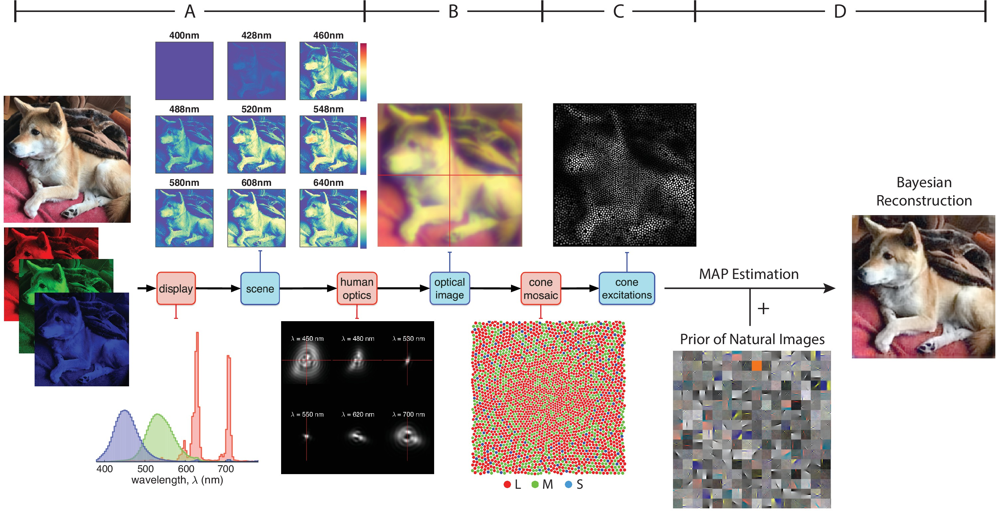

生物の視覚は実世界をセンシングする感覚器に制約される．人間の眼球によるセンシングはカメラのレンズとセンサに例えられることが多いが，厳密にいうと異なる点は多い．明るい環境下で機能する人間の光センサであるL・M・S錐体は，カメラのRGBセンサとは分光感度が大きく異なる．また，人間の網膜においては，センサの配列はカメラのベイヤー配列のように規則的に並んでいるわけではない．さらに，配列に厳密な規則性を持っていないだけでなく，L・Mの錐体の比率も個人差が大きいことが知られる．L錐体とM錐体のどちらかしかない個人は色覚多様性として知られるが，典型色覚とカテゴライズされる個人の中でも，L錐体とM錐体の分布は大きく異なる．

いったん人間の眼球というセンシングの複雑さを目の当たりにすると，センシングをすることと世界を認識することの関係という不思議にあなたは好奇心を持つだろう．私たちの眼球がもし今と少し違ったらどうなっていただろう．そして，私たちがこうしたセンシングで世界をみていることに何か必然性はあるのだろうか，と．

こうした好奇心に答えるひとつの研究アプローチは，視覚のセンシングについてのシミュレーターを開発することである．光入力に対する人間のセンシングを再現することができれば，パラメータを操作することで，少し違うセンサを持って世界をみることをシミュレートすることができる．さらに，大規模な自然画像をそのシミュレータを通して解析することで，私たちが持つ視覚センシングの機能的な必然性に迫ることが可能になる．

こうした試みを長年行っているのがISETBioというオープンソースプロジェクトだ（https://github.com/isetbio/isetbio/wiki）．次の記事では，このプロジェクトを利用した近年の論文を紹介する．

Zhang, L. Q., Cottaris, N. P., & Brainard, D. H. (2022). An image reconstruction framework for characterizing initial visual encoding. Elife, 11, e71132.
https://elifesciences.org/articles/71132

